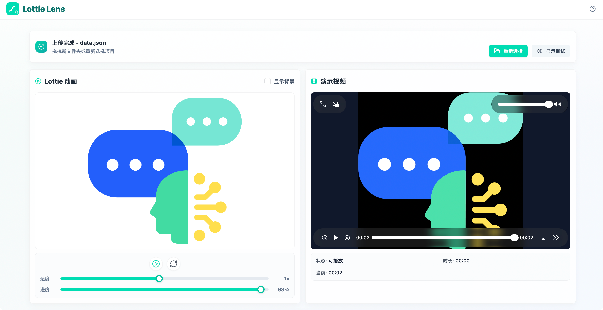

# Lottie Lens

[English](./README.en.md)

一个本地优先的 Lottie 文件校验、动画预览和资源检查工具。打开网页，把 Lottie 项目文件夹拖进去，就能同时验证 Lottie JSON、查看图片资源映射和演示视频。

[立即体验 Lottie Lens](https://twoer.github.io/lottie-lens/)



## 它解决什么问题

Lottie 交付文件通常不只有一个 JSON，还会包含图片资源、演示视频和文件夹路径。Lottie Lens 帮你在浏览器里快速检查：

- 动画 JSON 是否可以正常播放。
- 图片资源是否能被正确识别和映射。
- 演示视频是否能在当前浏览器播放。
- 动画和视频是否方便并排对比。

所有文件都在浏览器本地读取，不会上传到服务器。

## 适合场景

- 交付前快速做 Lottie 文件校验，确认 JSON、图片资源和演示视频是否完整。
- 设计、动效和前端同学一起做 Lottie 动画预览与验收。
- 排查 Lottie assets 引用、图片路径、文件名大小写和浏览器视频格式兼容问题。
- 在不上传素材的前提下，本地验证客户或项目中的 Lottie 动画文件。

## 快速使用

1. 打开 [在线体验](https://twoer.github.io/lottie-lens/)。
2. 点击 `选择文件夹`，或把完整的 Lottie 项目文件夹拖入页面。
3. 使用播放、速度、进度和背景控制检查动画细节。

如果视频提示格式不兼容，建议先转成 MP4，或者使用支持该格式的浏览器打开。

## 推荐文件夹结构

```text
my-lottie-project/
├── animation.json
├── images/
│   ├── img_0.png
│   ├── img_1.png
│   └── ...
└── demo.mp4
```

## 功能特性

- Lottie 动画预览：播放、暂停、重置、速度、进度和背景控制。
- 文件夹识别：自动识别 JSON、图片资源和演示视频。
- 图片资源映射：将本地图片文件映射到 Lottie assets 引用。
- 视频状态检查：支持 MP4、WebM 等浏览器可播放格式，并提示 MOV 等格式兼容性问题。
- PWA 支持：部署到 HTTPS 后可以安装到桌面。
- 静态部署：可部署到 GitHub Pages、Vercel、Netlify 或任意静态文件服务器。

## 隐私说明

Lottie Lens 不会上传你的文件。

你选择的 JSON、图片和视频只会被浏览器本地读取。应用会创建本地 Blob URL 用于预览，并在替换项目或关闭页面时清理这些资源。

## 本地开发

### 环境要求

- 推荐 Node.js 22。
- npm

### 安装

```bash
npm install
```

### 启动

```bash
npm run dev
```

默认地址：

```text
http://localhost:5173/
```

### 检查和测试

```bash
npm run type-check
npm run lint:check
npm run stylelint:check
npm run format:check
npm test
```

### 构建

```bash
npm run build
```

构建产物输出到 `dist/`。

## 技术栈

- Vue 3
- TypeScript
- Vite
- Vue Router
- Tailwind CSS
- Lottie Web
- 本地 shadcn 风格 Vue 组件
- Lucide Vue icons
- Vitest
- Vue Test Utils
- Playwright

## 浏览器说明

- MP4 兼容性最好。
- MOV 通常在 Safari 里支持更好，在 Chromium 浏览器中可能无法播放。
- PWA 不会缓存用户选择的本地文件，重新打开后需要再次选择文件夹。

## 参与贡献

欢迎提交 issue 和 pull request。提交前建议运行：

```bash
npm run type-check
npm run lint:check
npm run stylelint:check
npm run format:check
npm test
npm run build
```

## 许可证

MIT
